# `Smart Lamp`
The Smart Lamp is a system designed to control LED lights through voice. The voice control is facilitated by a mobile application utilizing the 'PocketSphinx' library, which includes wake word detection for initiating voice recognition. 'PocketSphinx' is an open-source speech recognition toolkit created by CMUSphinx (https://cmusphinx.github.io/). The current voice recognition model in the application has limited accuracy, as it relies on the default CMUSphinx model. I encourage you that use this system to build your own model and train it for better accuracy. To use the system, simply say 'hey phoenix,' followed by 'commands' to issue voice commands. These commands are then sent via HTTP requests, managed by the 'Volley' library, to the ESP32. When the request is successful, you'll observe the LED turning on in your circuit. There are also additional features to control LED such as set timer to LED for it to be turned off and change LED colour. You can also see data analysis where it monitor current in the circuit using ACS712 sensor. This feature used to monitor if there is a problem to the circuit then you will see the current dropping or no current flow by using the graph shown in the feature. Moreover, you can control manually if you do not prefer control using your voice.

## Video Tutorial
```
https://youtu.be/qMK6ij1JYLE
```

## Software Requirements
| `Software` | `Version` |
| --------------------- | ----------------------------------------- |
| Arduino IDE           | <p>Version 2.2.1 `Recommended`</p> <p>CLI Version 0.34.0 `Recommended`</p> |
| Android Studio        | <p>Version Hedgehog 2023.1.1 `Recommended`</p> <p>Graddle Version 8.3 `Recommended`</p> <p>SDK Version 34 `Recommended`</p> <p>JDK Version 21 `Recommended`</p> |                 

## Hardware Requirements
| `Hardware` | `Specification` |
| ---------- | ------ |
| | ESP32 WROOM-32 |
| | GL-12 Breadboard | 
| | RGB LED |
|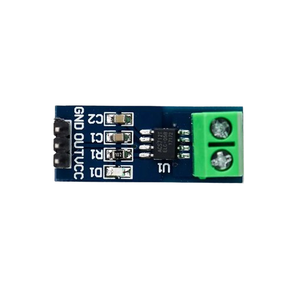 | ACS712 5A Module |
| | 220Ω Resistor |
| | Jumper Wires |
| | 3.7V LiPo Battery |

## Wiring Diagram


## Basic Flow of The System


## Mobile Application Interface
- **Potrait View**
<p align="middle">
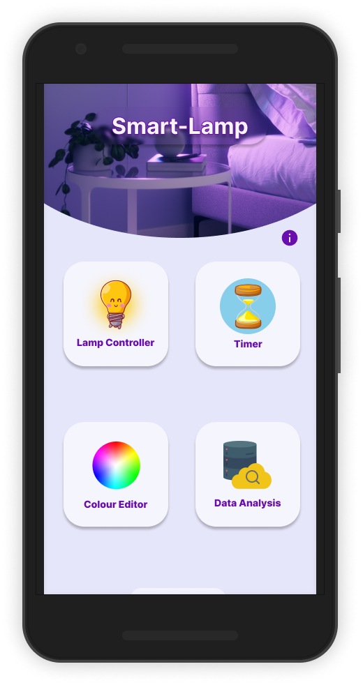
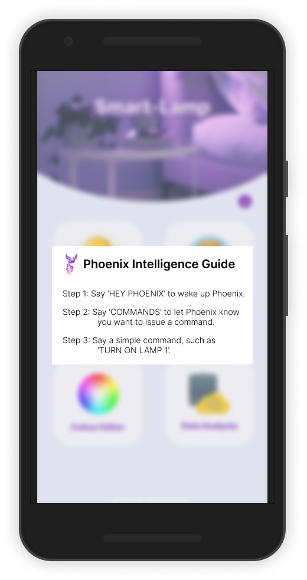
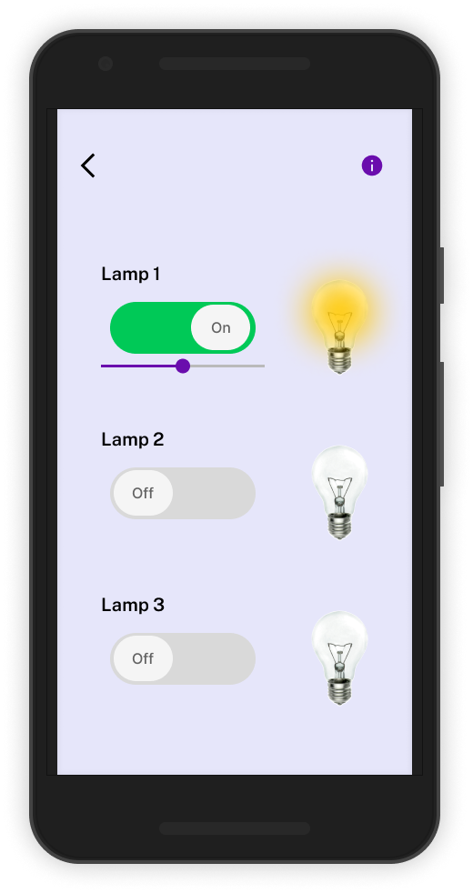
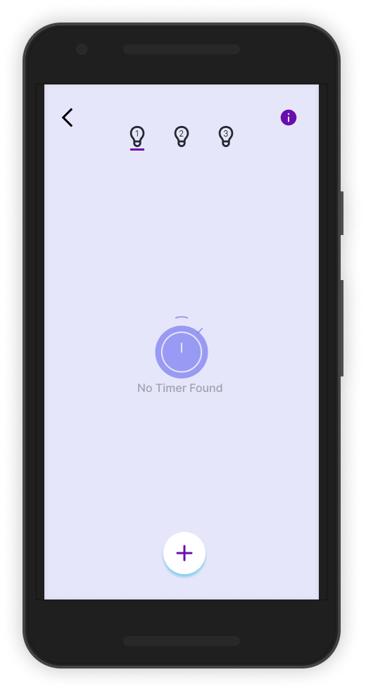
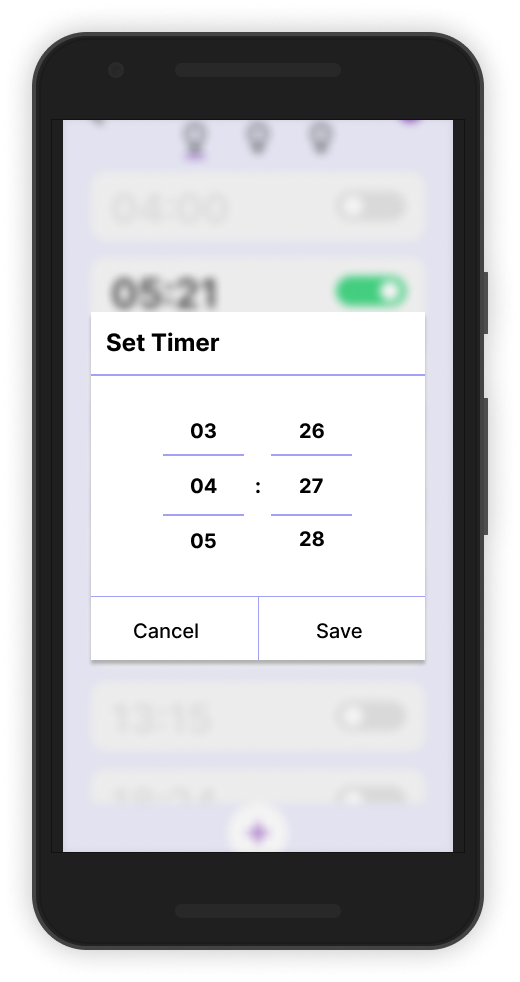
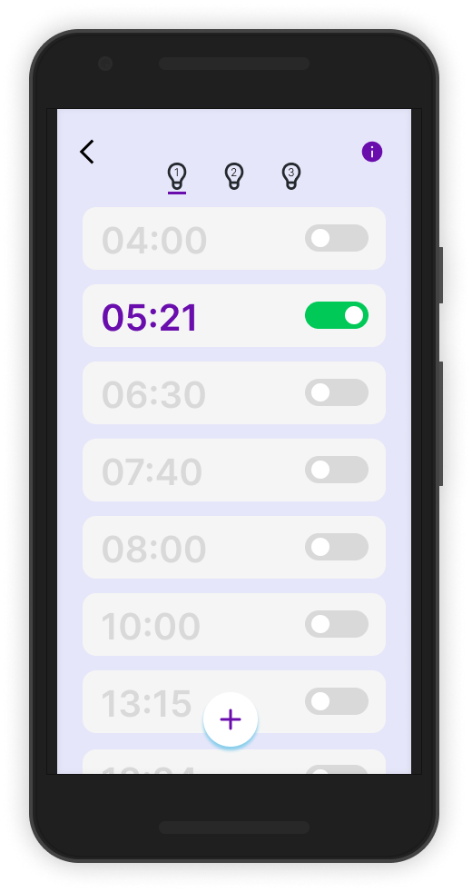
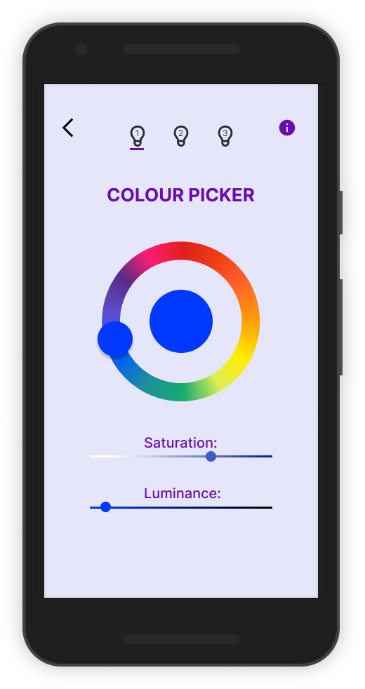
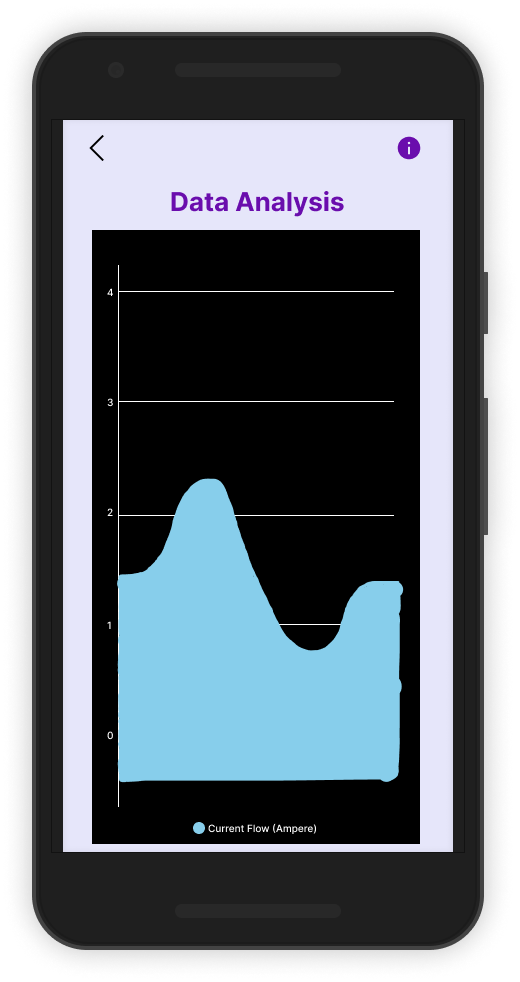
</p>

- **Landscape View**
<p align="middle">
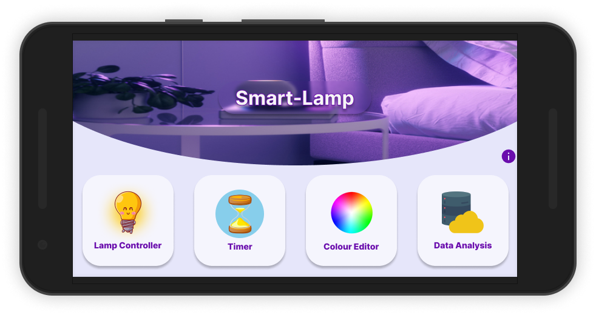
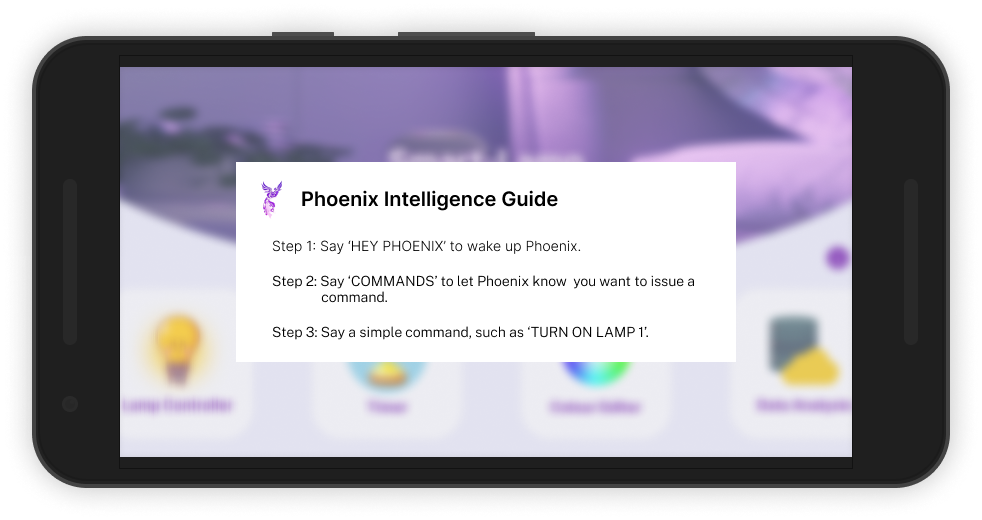
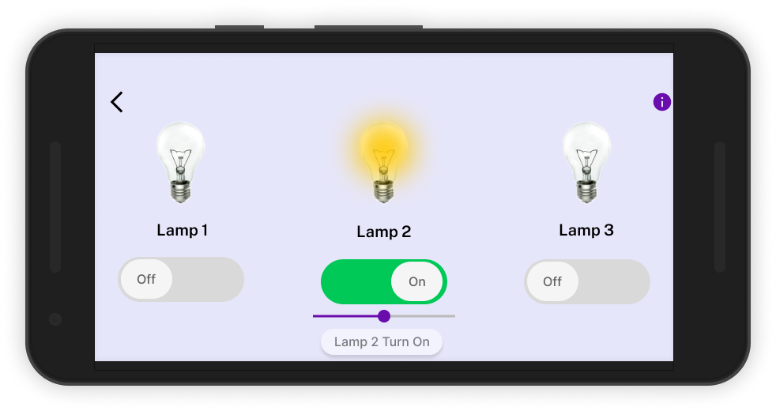
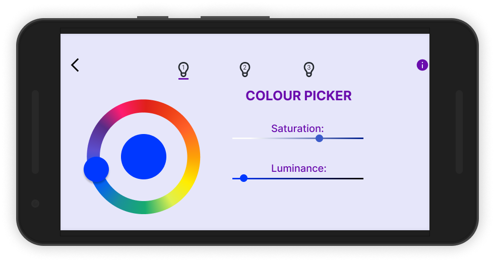
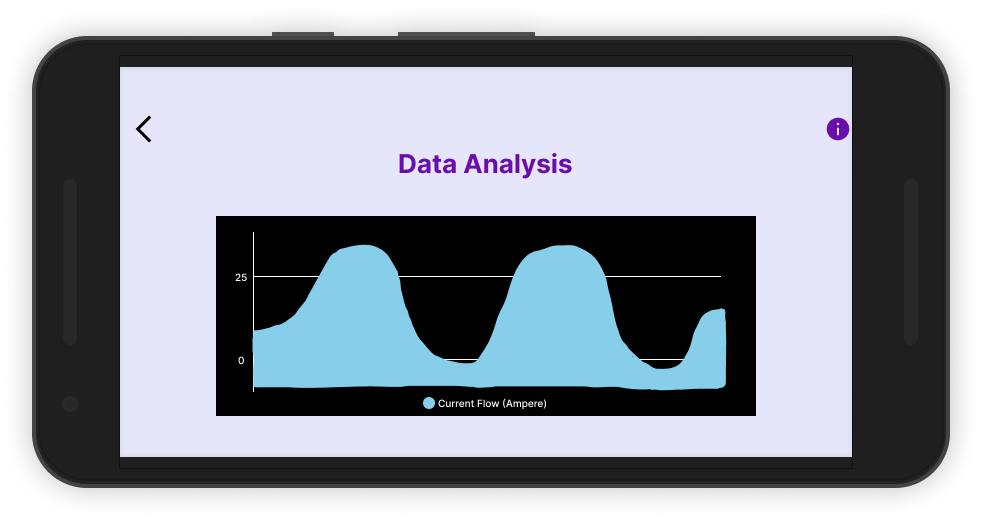
</p>

## License
```
MIT License

Copyright (c) 2024 Hazmi Hazim Bin Zairul Fuaad

Permission is hereby granted, free of charge, to any person obtaining a copy
of this software and associated documentation files (the "Software"), to deal
in the Software without restriction, including without limitation the rights
to use, copy, modify, merge, publish, distribute, sublicense, and/or sell
copies of the Software, and to permit persons to whom the Software is
furnished to do so, subject to the following conditions:

The above copyright notice and this permission notice shall be included in all
copies or substantial portions of the Software.

THE SOFTWARE IS PROVIDED "AS IS", WITHOUT WARRANTY OF ANY KIND, EXPRESS OR
IMPLIED, INCLUDING BUT NOT LIMITED TO THE WARRANTIES OF MERCHANTABILITY,
FITNESS FOR A PARTICULAR PURPOSE AND NONINFRINGEMENT. IN NO EVENT SHALL THE
AUTHORS OR COPYRIGHT HOLDERS BE LIABLE FOR ANY CLAIM, DAMAGES OR OTHER
LIABILITY, WHETHER IN AN ACTION OF CONTRACT, TORT OR OTHERWISE, ARISING FROM,
OUT OF OR IN CONNECTION WITH THE SOFTWARE OR THE USE OR OTHER DEALINGS IN THE
SOFTWARE.
```