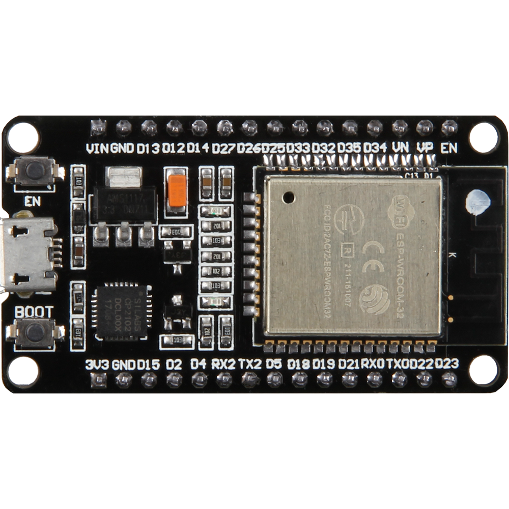
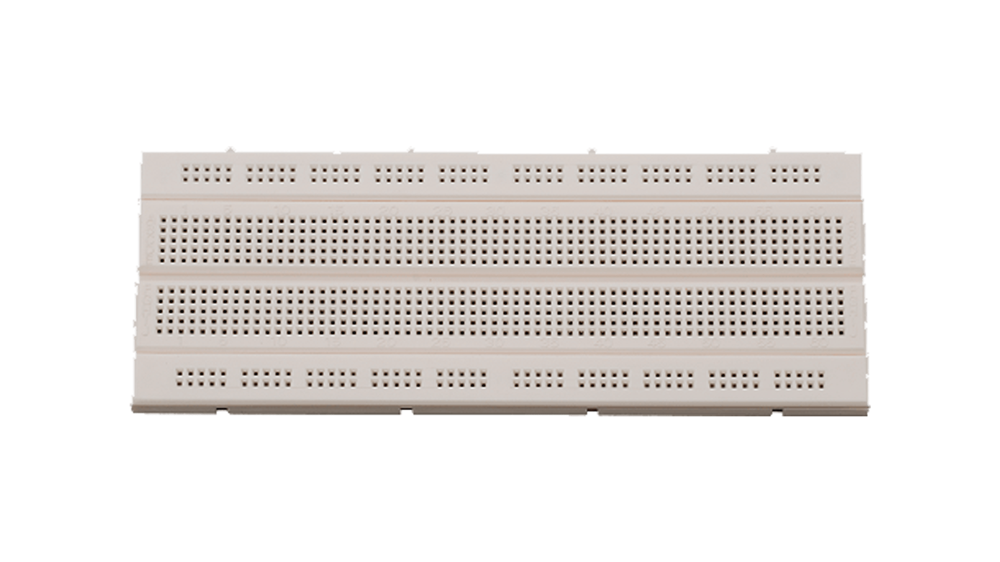
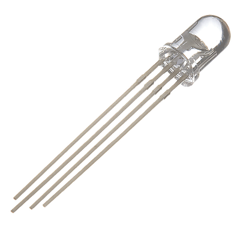
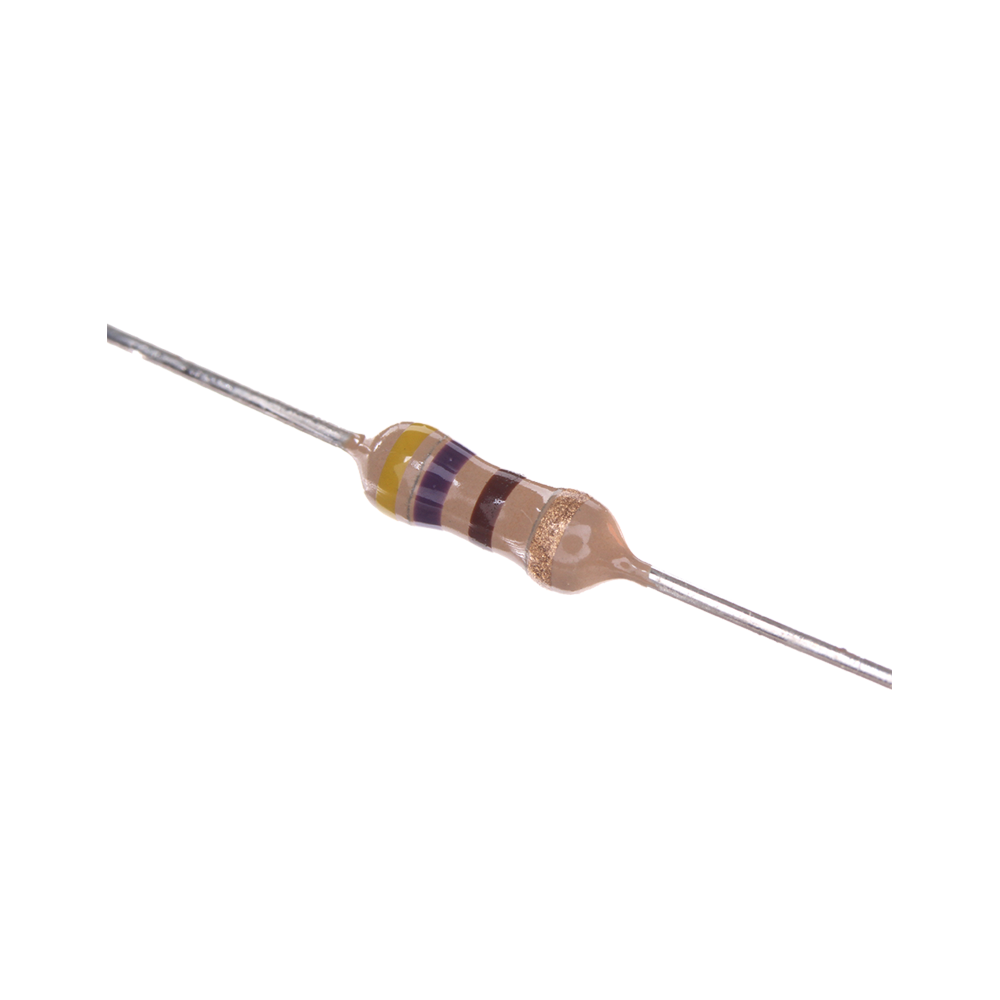
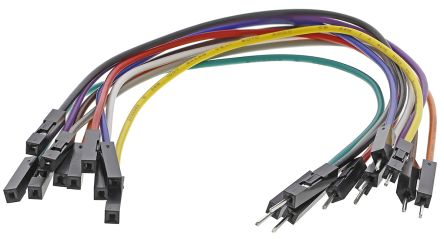
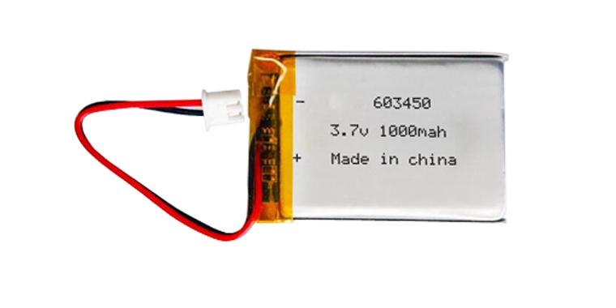
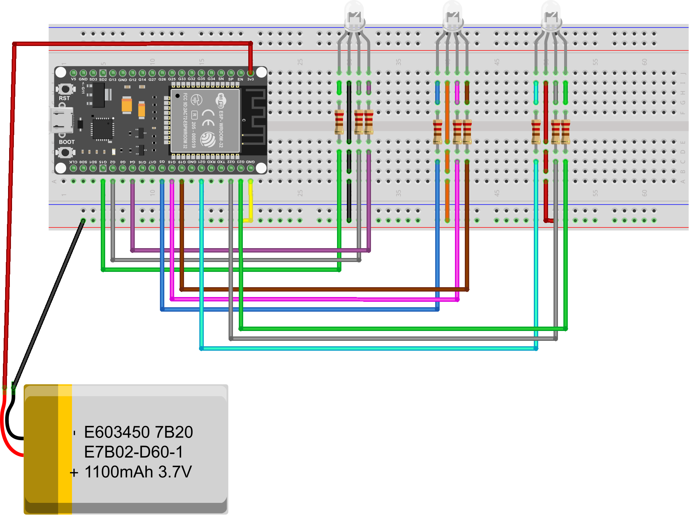
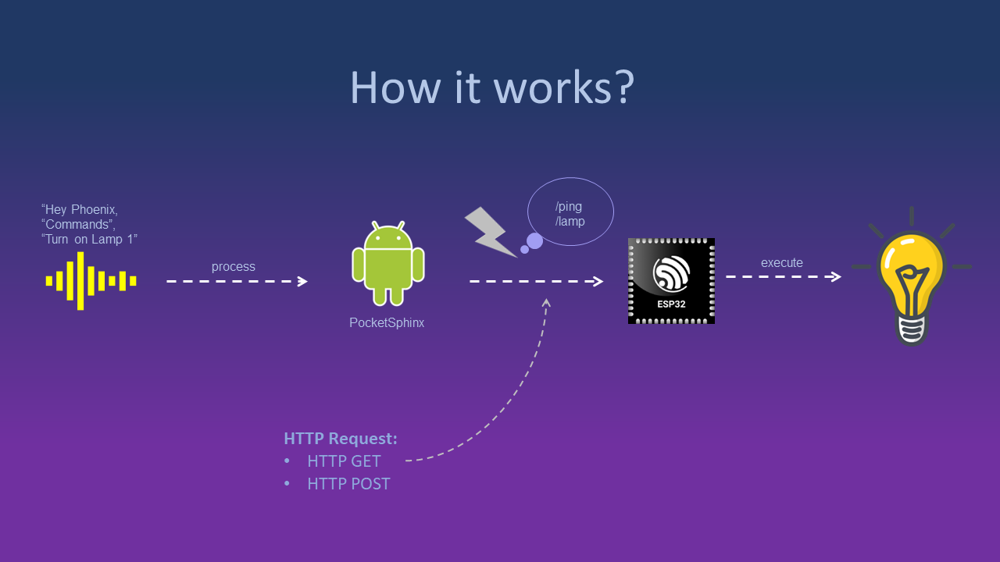

# `Smart Lamp Project`
The Smart Lamp project is an Internet of Things (IoT) system that integrates the ESP32 with a mobile application developed using Android Studio.

## Software Requirements
| `Software` | `Version` |
| --------------------- | ----------------------------------------- |
| Arduino IDE           | 
Version 2.2.1 `Recommended`
 
CLI Version 0.34.0 `Recommended`
 |
| Android Studio        | 
Version Giraffe 2022.3.1 `Recommended`
 
Graddle Version 8.3 `Recommended`
 
SDK Version 33 `Recommended`
 
JDK Version 21 `Recommended`
 |                 

## Hardware Requirements
| `Hardware` | `Specification` |
| ---------- | ------ |
| | ESP32 WROOM-32 |
| | GL-12 Breadboard | 
| | RGB LED |
| | 220Ω Resistor |
| | Male to Male Jumper Wires |
| | 3.7 LiPo Battery |

## Wiring Diagram

## Basic Flow of The System

## Mobile Application Interface